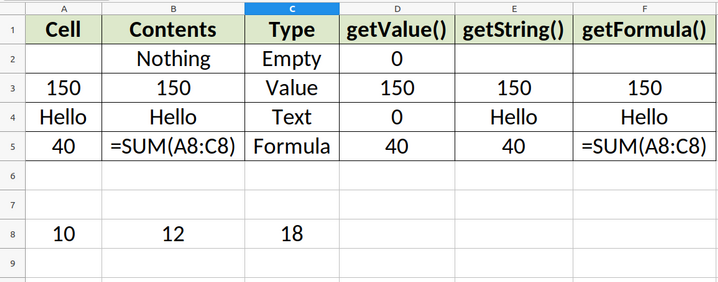

# Dealing with Cell Types

Determining the type of value in a cell is very important to avoid unexpected errors when you run a macro. For example, if your macro performs mathematical operations using values from cells, you might be interested in determining if the cell contains numerical values instead of text.

Bascally, the contents of a cell can be one of four types:

1. Empty cell
2. Numeric value
3. Text
4. Formula

To determine the data type in a cell we can use the `getType()` method and compare the returned value with the set of constants available in `com.sun.star.table.CellContentType`, which is part of the LibreOffice API.

To get a better idea of how cell types work, take a look at the macro `PrintCellType` below:

```VBA
Sub PrintCellType
	'Gets the currently selected cell
	Dim oCell as Object
	oCell = ThisComponent.getCurrentSelection()
	'Enum with constants corresponding to all possible cell types
	Dim eTypes as Variant
	eTypes = com.sun.star.table.CellContentType
	'Check cell type
	Select Case oCell.getType()
		Case eTypes.EMPTY
			MsgBox "Empty Cell"
		Case eTypes.VALUE
			MsgBox "Cell with Numeric Value"
		Case eTypes.TEXT
			MsgBox "Cell with Text"
		Case eTypes.FORMULA
			MsgBox "Cell with Formula"
		Case Else
			MsgBox "Something Else"
	End Select
End Sub
```

This macro gets the type of the current cell and prints its type in a message box. The main takeaway in this macro is the use of `com.sun.star.table.CellContentType` to compare the value returned by `getType()`. This method is only available to cell objects, so the macro will not work if you select multiple cells.

`CellContentType` is an enumeration that contains only the four values used in the macro. Click [here](https://api.libreoffice.org/docs/idl/ref/CellContentType_8idl.html) to read the official API documentation.

A more useful approach to dealing with cell types is to create a `Function` to which you can pass a cell object and get the cell type in a readable format. Bellow is the implementation of such function:

```VBA
Function GetCellTypeName(oCell) as String
	Dim eTypes as Variant
	eTypes = com.sun.star.table.CellContentType
	'Check cell type
	Select Case oCell.getType()
		Case eTypes.EMPTY
			GetCellTypeName = "Empty"
		Case eTypes.VALUE
			GetCellTypeName = "Value"
		Case eTypes.TEXT
			GetCellTypeName = "Text"
		Case eTypes.FORMULA
			GetCellTypeName = "Formula"
		Case Else
			GetCellTypeName = "Unknown"
	End Select
End Function
```

One important aspect of reading values from cells is that, regardless of the current cell type, the three functions `getValue`, `getString` and `getFormula` will always return something. The figure below shows what each of these functions would return for all possible cell types. You can download the ODS file containing these values at the end of the topic.



To create the table presented in the image above I used a macro that read all input cells and applied the `get` functions to see what was returned. You can check out the code for this macro below:

```VBA
Sub CheckCellTypes
	Dim oCell as Object, oCellWrite as Object
	Dim cType as String
	For i = 1 to 4
		'Get the cell type as a String
		oCell = ThisComponent.Sheets(0).GetCellByPosition(0, i)
		cType = GetCellTypeName(oCell)
		'Write the cell type
		oCellWrite = ThisComponent.Sheets(0).GetCellByPosition(2, i)
		oCellWrite.setString(cType)
		'Write the results of getValue()
		oCellWrite = ThisComponent.Sheets(0).GetCellByPosition(3, i)
		oCellWrite.setString(oCell.getValue())
		'Write the results of getString()
		oCellWrite = ThisComponent.Sheets(0).GetCellByPosition(4, i)
		oCellWrite.setString(oCell.getString())
		'Write the results of getFormula()
		oCellWrite = ThisComponent.Sheets(0).GetCellByPosition(5, i)
		oCellWrite.setString(oCell.getFormula())
	Next i
End Sub
```

## Download the Example

You can download the ODS file with the macros created in this topic by clicking [here](../ods/Cell_Types.ods).
