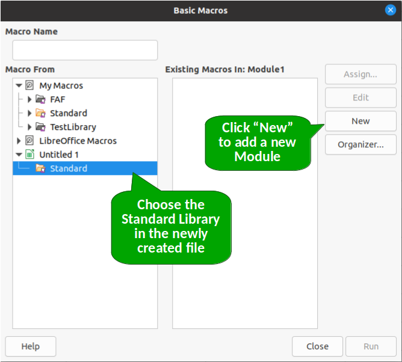
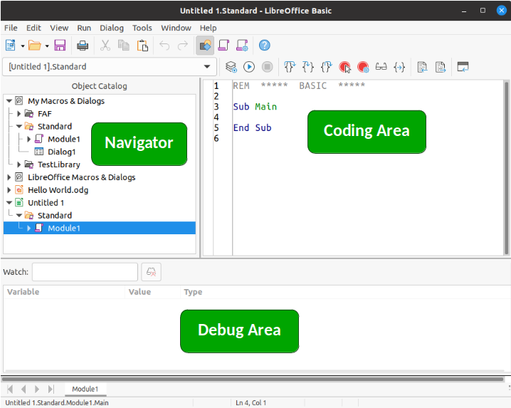
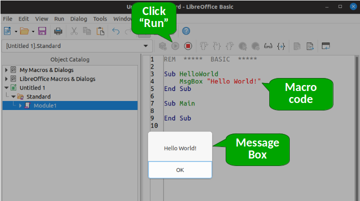
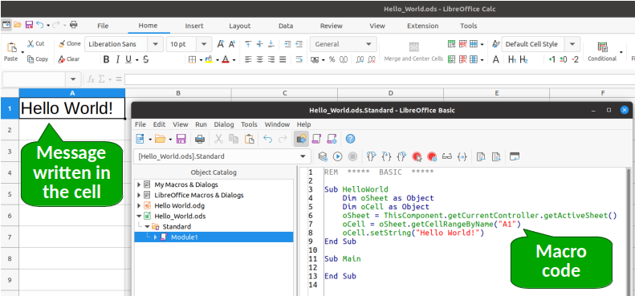

# Saying "Hello World" with a Macro on LibreOffice Calc

## Introduction

When we learn a new programming language it is very common to start with a Hello World example. The objective of such an introductory example is to provide the newcomer with an overview of how the programming language works and how code is organized.

In this tutorial we will create two versions of our Hello World macro:

1. The first one will show a Message Box with the "Hello World" message in it.
2. The second version will write the message "Hello World" into cell A1 of the currently active sheet.

Keep in mind that we won't get into a lot of details in this example because our goal here is to get you started with a complete example. In future topics we will address more complex aspects that will be overlooked here.

## Creating your First Module

In LibreOffice, macros are organized in Modules. To create your first module, open LibreOffice Calc and create a new file. Then go to **Tools > Macros > Organize Macros > Basic**. You'll be presented with the following dialog.



In the dialog window, choose the newly created Calc file on the left section named **Macro From**, which in this example is *Untitled 1*, then click **New**. A pop-up dialog will open for you to name the new module. You can use the default name *Module1* or give a different name if you prefer.

## Using the Basic IDE

After you click **OK** and create the new module, the Basic IDE (Integrated Development Environment) window will show up. The Basic IDE is where you will create and edit your macros.



By default LibreOffice will always create a *Main* macro, which in this example we will leave empty. You do not need to delete this macro, just leave it as it is.

## Saying "Hello World" with a Message Box

As I mentioned at the beginning of this topic, the first version of our "Hello World" example will show a message using a message box. We'll use this strategy now because it is one-liner, hence much simpler for our first macro.

Enter the following code in the code editor:

```VBA
Sub HelloWorld
	MsgBox "Hello World!"
End Sub
```

To run this macro, just click anywhere inside the code of the *HelloWorld* macro and then press the **Run** button (see image below). Alternativelly you can press the *F5* key as a shortcut to run your macro.



## Saying "Hello World" inside a Cell

Now we will write the message "Hello World!" in cell *A1* of the active sheet. To do that, go to **Tools > Macros > Organize Macros > Basic** to open the Basic IDE and enter the following code:

```VBA
Sub HelloWorld
	Dim oSheet as Object
	Dim oCell as Object
	oSheet = ThisComponent.getCurrentController.getActiveSheet()
	oCell = oSheet.getCellRangeByName("A1")
	oCell.setString("Hello World!")
End Sub
```

Now you can run this macro as we did in the previous example, which will make the text "Hello World!" appear in cell *A1* as shown in the image below.



This code is a bit more complex that the previous one (that's why I left this as the second example!). Basically it creates two *Object* variables, one to store the current sheet and one to refer to cell *A1*. Then we use the method *setString()* to add the string "Hello World" into the cell.

Do not worry too much if you did not understand all this code. LibreOffice API is a bit complex at first, buth with time you'll get the hang of it. In future topics I'll discuss in more detail how to declare variables and read/write data from/to sheets and cells.

## A line-by-line explanation

Here I'll give a brief explanation of the Basic code we created for the Hello World macro.

```VBA
Sub HelloWorld
	'Macro code here
End Sub

```

In Basic a macro is called a Sub. Hence *Sub* is a reserved word in Basic that states that we are creating a new macro named *HelloWorld*. The macro ends with the combination of words *End Sub*.

```VBA
Dim oSheet as Object
Dim oCell as Object
```

The reserved word *Dim* is used to declare variables and the word *As* precedes the variable type. Here we are creating variables *oSheet* and *oCell*, both of *Object* type.

Note that we could have given any names to these variables, as long as they respect the variable naming conventions used by the Basic language.

```VBA
oSheet = ThisComponent.getCurrentController.getActiveSheet()
```

*ThisComponent* is a LibreOffice runtime object that provides access to the currently opened document. The method *getCurrentController* returns the document's controller that gives acces to many aspects of the document. Finally, *getActiveSheet()* returns an Object containing the active sheet, which is stored in the *oSheet* variable.

```VBA
oCell = oSheet.getCellRangeByName("A1")
```

Now that we have the active sheet stored in *oSheet*, we can call the method *getCellRangeByName("A1")* to get a Object containing cell *"A1"* and store it into the *oCell* variable.

```VBA
oCell.setString("Hello World!")
```

Finally we can use the method *setString()* of the cell object to insert the string "Hello World!" into cell *A1*.

## Download the Example

You can download the ODS file with both versions of the "Hello World" examples by clicking [here](../ods/Hello_World.ods).
