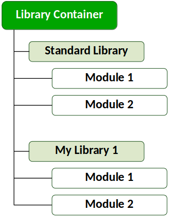
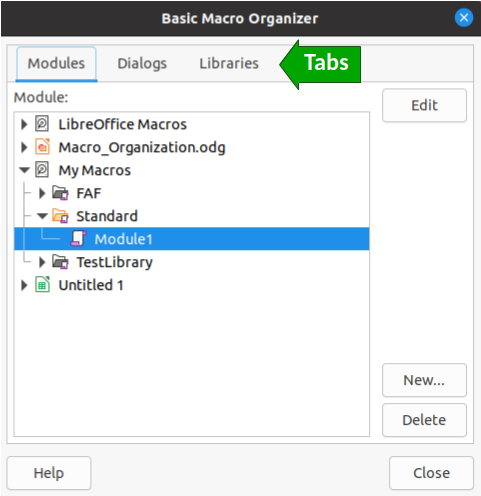

# How are Macros organized in LibreOffice?

If you've already read our [Hello World](./Hello_World.md) example, you may have noticed that we had to create a module inside the Standard library of the ODS file. Maybe you asked yourself why we had to do so. And why are there so many other items in the *Basic Macros* dialog?

## Hierarchy of Macro Containers

To understand how macros are organize, let's take a closer look at the *Basic Macros* dialog, which can be opened by going to **Tools > Macros > Organize Macros > Basic**.

At the highest level we have three *library containers*:

- **My Macros:** Used to store macros that will be available to all documents, as well as all LibreOffice applications.
- **LibreOffice Macros:** These are macros that come preinstalled with LibreOffice to perform some useful tasks. You can open and read the code of all these macros, which is a good way to learn advanced topics. However, it's not advisable that you edit these macros.
- **Untitled 1:** This is the library container of the opened file. Macros stored here will only be available in this specific file.

Each file is a library container. If you had more files open, you would see all of them listed in this dialog. The figure below summarizes the hierarcy used by LibreOffice to organize macros.

Library containers are composed of one or more *Libraries*. Every library container (except the *LibreOffice Macros*) is created with a *Standard* library. You can create more libraries to organize your code, which is specially useful for large projects.

:warning: Beware that macros written inside the Standard library cannot be exported, nor can you import macros into the Standard library of any library container.

Libraries are composed of one or more *Modules*. Inside each module you'll be able to write your own macros. To create new modules you just need to choose a library container and click the **New** button in the Basic Macros dialog.

## Using the Macro Organizer dialog

With the Basic Macros dialog open, you can click the **Organizer** button to open the *Basic Macro Organizer* dialog.

The upper part of the dialog contains three tabs that indicate the type of element you wish to create:

- **Modules:** You can use this dialog to create new modules. For that you just need to choose the library into which you want to create the module and then press the **New** button.
- **Dialogs:** You can create your own dialogs with buttons, textboxes, listboxes, etc. These are useful when you need user interface elements to interact with the user in your macro. To create a dialog, click the **Dialog** tab, choose the destination library and then press the **New** button
- **Libraries:** Use this tab to create a new library inside a library container. For that, click the **Libraries** tab and you'll be presented with a slightly different dialog. First you'll have to choose the **Location**, which is the library container into which you want to create your new library. Then click **New** and enter the name of your new library.
