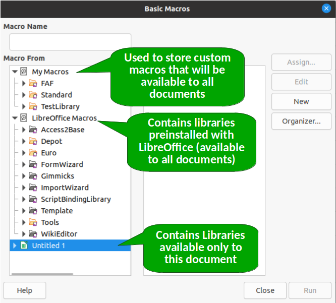

# How are Macros organized in LibreOffice?

If you've already read our [Hello World](./Hello_World.md) example, you may have noticed that we had to create a module inside the Standard library of the ODS file. Maybe you asked yourself why we had to do so. And why are there so many other items in the *Basic Macros* dialog?

To understand how macros are organize, let's take a closer look at the *Basic Macros* dialog, which can be opened by going to **Tools > Macros > Organize Macros > Basic**.

At the highest level we have three *library containers*:

- **My Macros:** Used to store macros that will be available to all documents, as well as all LibreOffice applications.
- **LibreOffice Macros:** These are macros that come preinstalled with LibreOffice to perform some useful tasks. You can open and read the code of all these macros, which is a good way to learn advanced topics. However, it's not advisable that you edit these macros.
- **Untitled 1:** This is the library container of the opened file. Macros stored here will only be available in this specific file.

Each file is a library container. If you had more files open, you would see all of them listed in this dialog. The figure below summarizes the hierarcy to organize macros.

Library containers are composed of one or more *Libraries*. Every library container container (except the *LibreOffice Macros*) is created with a *Standard* library. You can create more libraries to organize your code, which is specially useful for large projects.

Libraries are composed of one or more *Modules*. Inside each module you'll be able to write your own macros.
