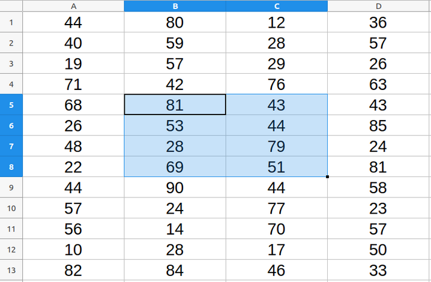

# Reading Data from Multiple Cells

In many occasions you will want to read and process values stored in multiple cells. In this topic I'll present the most common ways to get access and read data from multiple cells at once.

## Reading the Current Selection

The first case is when the user has a single selection of multiple cells, as shown in the image below.



Lets imagine you want to see how many rows and columns there are in the current selection. The macro below shows how you can access such information and present it to the user.

```VBA
Sub CountRowsCols
	Dim selRange as Object
	Dim selCols, selRows
	'Gets the current selection
	selRange = ThisComponent.getCurrentSelection()
	'Checks if it is a single celll or a range of cells
	If selRange.supportsService("com.sun.star.sheet.SheetCell") Then
		MsgBox "A single cell is selected"
	ElseIf selRange.supportsService("com.sun.star.sheet.SheetCellRange") Then
		'Get the number of rows and columns
		selCols = selRange.Columns
		selRows = selRange.Rows
		MsgBox "The cell range has " & selRows.getCount() & " rows and " & selCols.getCount() & " columns"
	End If
End Sub
```

There are some important things in this macro. First, it checks whether the user selected a single cell (service `SheetCell`) or a cell range (service `SheetCellRange`). In case the user selected a cell range, we can use the attributes `Columns` and `Rows` to get access to all columns and rows in the selection. Finally, the method `getCount()` returns how many rows and columns exist in the object.

## Iterating over a Range of Cells

Instead of using the current selection, we can use the method `getCellRangeByName()` and selected a fixed range as in the example below:

```VBA
Sub CountGreaterThanFifty
	Dim selRange as Object
	selRange = ThisComponent.Sheets(0).getCellRangeByName("B5:D10")
	'Gets the number of rows and columns in the selection
	Dim nRows as Integer, nCols as Integer
	nRows = selRange.Rows.getCount()
	nCols = selRange.Columns.getCount()
	Dim contValues as Integer
	Dim oCell as Object
	'Iterate over all cells in the selection
	For i = 0 To nCols - 1
		For j = 0 To nRows - 1
			value = selRange.getCellByPosition(i, j).getValue()
			If value > 50 Then contValues = contValues + 1
		Next j
	Next i
	'Shows a message with the number of cells greater than 50
	MsgBox "There are " & contValues & " cells with value greater than 50"
End Sub
```

The macro above counts how many cells in the range *B5:D10* have values greater than 50. To iterate over all cells in the selection we need to use the `getCellByPosition` method. However, note that this method is being applied to the selection instead of the entire sheet. This means that position (0, 0) is actually the first cell in the selection, which in this example is cell *B5*.


## Reading Data as an Array of Values

After you have a `SheetCellRange` object you can either iterate over all cells as we did in the previous example, or you can read all the data straight into a Array object using the methods `getData` and `getDataArray`.

The main difference between them is that `getData` returns an Array with only numerical values whereas `getDataArray` returns an Array with numerical values and strings. The following macro sum all numerical values in the range *A1:B3*.

```VBA
Sub SumCells
	'Gets the current sheet
	Dim curSheet as Object
	curSheet = ThisComponent.getCurrentController.getActiveSheet()
	'Gets the desider cell range
	Dim oRange as Object
	oRange = curSheet.getCellRangeByName("A1:B3")
	'Gets the data inside the range
	Dim data as Variant, valSum as Double
	data = oRange.getDataArray()
	'Iterates over all values in the array
	For i = 0 To UBound(data)
		For j = 0 To UBound(data(i))
			valSum = valSum + data(i)(j)
		Next j
	Next i
	'Shows a message with the sum of all values
	MsgBox "The sum of all values in A1:C3 is " & valSum
End Sub
```

In this macro the `getDataArray` method creates an Array object containing all the data in the original range. The `data` object is actually an Array of Arrays and hence two indices are required to read each individual value in the array. The first index is used to access the rows and the second is used to access the columns.

Considering the range *A1:B3*, the function `UBound(data)` would return 2, meaning that the highest index for rows is 2. Keep in mind that the arrays returned by `getDataArray` are indexed starting at zero. Then the function `UBound(data(i))` returns the highest index for each row, which in this example is 1 because there are only two columns in the range.

At this point you may be thinking: what if the range *A1:B3* contained a text value? Would it cause an error? The answer is no, if there were a string value in the array, the string would be considered as zero when adding to the `valSum` variable.

## Download the Example File

You can download the example file containing all the examples in this topic by clicking [here](../ods/Multiple_Cells.ods).
