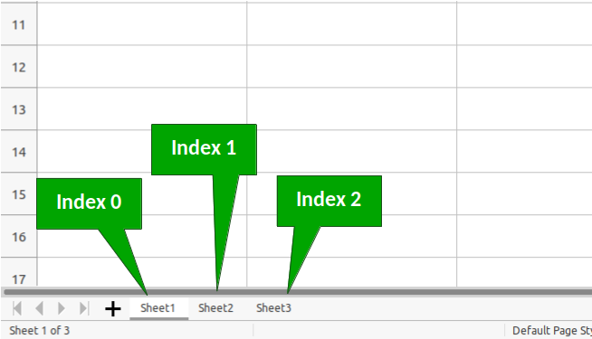
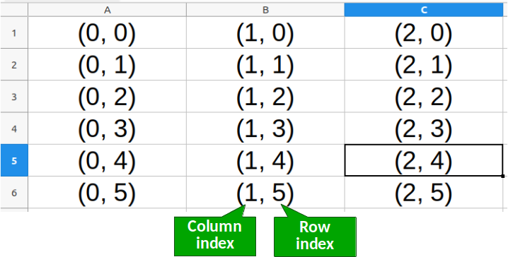

# Reading Values from Single Cells

Macros written for LibreOffice Calc often need to read data from spreadsheets to perform calculations or any other desired operations. In this topic I'll explain the most commonly used methods to:

1. Access cell objects and...
2. Read the data stored in these cells.

Here we'll focus on reading values from a single cell. For multiple cells, read the topic [Reading Multiple Cells](./topics/Reading_Data_Multiple_Cells.md).

## Introduction

Before reading values from a single cell or from multiple cells, we first need to get access to cell objects. If you read the [Hello World](./Hello_World.md) example you'll remember this part of the code.

```VBA
oSheet = ThisComponent.getCurrentController.getActiveSheet()
oCell = oSheet.getCellRangeByName("A1")
oCell.setString("Hello World!")
```

The first line assigns to `oSheet` the object that gives access to the Active Sheet of the current document. Then we use this object to get access to cell *A1* and store its corresponding object in `oCell`. Finally, in the third line we use the `oCell` object to call the method `setString("Hello World!")` that inputs the string into the cell.

This means that the key to reading/writing contents from/to cells is to first create an object that will grant us access to its properties and methods. In the following sections we'll discuss the many methods that can be used for this purpose.

## Getting Access to Sheets

As discussed above, before getting access to cells we first need to access a sheet object. As a first example, consider the following code:

```VBA
Sub ReadData
	Dim mySheet as Object
	Dim myCell as Object
	mySheet = ThisComponent.Sheets(0)
	myCell = mySheet.getCellRangeByName("A1")
	MsgBox myCell.getString()
End Sub
```

This macro reads the string value in cell *A1* of the first sheet in the Calc file and shows a message box with this string. Note that here we are acessing the sheet using its *index* number, which always starts at zero.

```VBA
mySheet = ThisComponent.Sheets(0)
```

Hence, if we have three sheets in our file, then their indices will range from 0 to 2, as shown below.



Another approach is to access sheets by their names, as shown in the code below:

```VBA
Sub ReadData
	Dim mySheet as Object
	Dim myCell as Object
	If ThisComponent.Sheets.hasByName("Balance") Then
		mySheet = ThisComponent.Sheets.getByName("Balance")
	Else
		MsgBox "The sheet 'Balance' does not exist"
		Exit Sub
	End If
	myCell = mySheet.getCellRangeByName("A1")
	MsgBox myCell.getString()
End Sub
```

In this example we are reading the contents of cell *A1* in a sheet named "Balance". Note that here the macro first tests if the file has a sheet with this name before proceeding. This is done with the `hasByName()` method of the sheet object.

Similarly, if we are acessing sheets by their index, we should first check if the index exists in the file to avoid unexpected errors. For that, we need to use the `ThisComponent.Sheets.Count` property, which returns the number of sheets in the current document.

```VBA
Sub ReadData
	Dim mySheet as Object
	Dim myCell as Object
	Dim sheetIdx as Integer
	'This is the sheet index we want to access
	sheetIdx = 2
	If sheetIdx + 1 <= ThisComponent.Sheets.Count Then
		mySheet = ThisComponent.Sheets.getByIndex(sheetIdx)
	Else
		MsgBox "The sheet does not exist"
		Exit Sub
	End If
	myCell = mySheet.getCellRangeByName("A1")
	MsgBox myCell.getString()
End Sub
```

Note that in this example we use the `getByIndex()` method to get access to a sheet object using its index number.

## Getting Access to Cell objects

There are two main ways to get access to cell objetcs. One of them - `getCellRangeByName()` was used a few times in some examples, so we'll start by discussing it. This is a method of sheet objects and is very straightforward to use. We just need to pass on the cell address, e.g. "A1", "D8", "H3", and it will return an object to the corresponding cell.

As an example, the following macro sums the values in cells "A1" and "A2" and writes the result in cell "A3". This example also introduces some methods used for reading/writing values which we'll discuss later.

```VBA
Sub SumCells
	Dim cell1 as Object, cell2 as Object, cellOut as Object
	cell1 = ThisComponent.Sheets(0).getCellRangeByName("A1")
	cell2 = ThisComponent.Sheets(0).getCellRangeByName("A2")
	cellOut = ThisComponent.Sheets(0).getCellRangeByName("A3")
	cellOut.setValue(cell1.getValue() + cell2.getValue())
End Sub
```

Keep in mind that here we'll only focus on single cells, however this method can also be used to access multiple cells at once by passing on addresses as "A1:A10".

The second way to access cells is to use the `getCellByPosition(col_number, row_number)` method. Instead of using text addresses, this method uses column and row indices thus treating the sheet as if it were a matrix of values. It is important to note that column and row indices start at zero.

Hence, position (0, 0) corresponds to cell "A1", (0, 1) refers to cell "A2" and address (2, 4) refers to cell "C5".



Accessing cells using position values is very useful when you need to iterate over multiple cells. For example, the following macro uses a `For ... Next` loop to sum values from cells "A1" through "A5" and write the result in cell "B1".

```VBA
Sub SumRange
	Dim oCell as Object
	Dim oSheet as Object
	'Stores the result
	Dim sumResult as Variant
	sumResult = 0
	'Get access to the first sheet
	oSheet = ThisComponent.Sheets(0)
	For i = 0 To 4
		oCell = oSheet.getCellByPosition(0, i)
		sumResult = sumResult + oCell.getValue()
	Next i
	'Writes the result in cell B1
	oCell = oSheet.getCellByPosition(1, 0)
	oCell.setValue(sumResult)
End Sub
```

## Getting Values from the Selected Cell

In some situations you'll want to access the cell that is currently selected in the document. To achieve this you have to use the `ThisComponent.getCurrentSelection()` method, as shown in the example below.

```VBA
Sub GetCurrentCellValue
	Dim oCell as Object
	oCell = ThisComponent.getCurrentSelection()
	MsgBox "Value in Cell: " & oCell.getValue()
End Sub
```

Beware that the code above my fail depending on what is selected in your document. For example, if you have multiple cells selected, you'll get an error message saying that the method `getValue()` does not exist for the object. To fix these issues, see the example below:

```VBA
Sub GetCurrentCellValue
	Dim oCell as Object
	oCell = ThisComponent.getCurrentSelection()
	'If there's nothing selected, exit the Sub without doing anything
	If IsNull(oCell) Then Exit Sub
	'Checks if the selected range is a single cell
	If oCell.supportsService("com.sun.star.sheet.SheetCell") Then
		MsgBox "Value in Cell: " & oCell.getValue()
	End If
End Sub
```

In this new example we check two possible errors:

- The line `If IsNull(oCell)` verifies if there's anything selected at all. If nothing is selected then the Sub is terminated.
- The command `oCell.supportsService("com.sun.star.sheet.SheetCell")` checks if the selection is a single cell, i.e. it supports the UNO service *SheetCell*.

The `supportsService` is very often used in LibreOffice macros to check the context in which the macro is being executed. Because macros are available across all applications (Writer, Calc, Impress, etc), it's important to determine if the macro is being run in the correct application.

If this sounds too complicated now, fear not! This aspect of LibreOffice macros will be covered in future topics and with time you'll get used to it.
